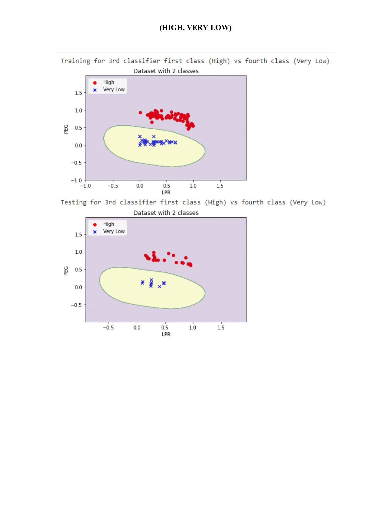

# Group 18 Applied Machine Learning Assignment 1 OVR-vs-OVO Classification Using SVM Model

 
A simple and well designed structure is essential for any machine learning project, project template that combines **simplicity, best practice for CODE structure** and **good CODE design**. 
The main idea is that there's much same stuff you do every time when you start our machine learning project, so wrapping all this shared stuff will help you to change just the core idea every time you start our machine learning project. 

**So, here’s a simple readme template that help you get into our project faster and just focus on your notice and explanations, etc.)**

In order to decrease repeated code shanks, increase the time that can read the code in, flexibility an reusability we used a functional programming structure that focused on split all problems in our project in functions and use that functions many times in many places in the code without repeating the code.
 

**The Assignment :**
-DUMD It is the real dataset about the students' knowledge status about the subject of Electrical DC
Machines. 
-using this data set to implement OVR-vs-OVO Classification using SVM Model

# Requirements
- [numpy](https://numpy.org/) (The fundamental package for scientific computing with Python)
- [pandas](https://pandas.pydata.org/) (pandas is a fast, powerful, flexible and easy to use open source data analysis and manipulation tool, built on top of the Python programming language.) 
- [google.colab.drive](https://colab.research.google.com/) (library to integrate google colab with google drive)
- [requests](https://pypi.org/project/requests/) (library to easily use API with python)
- [json](https://docs.python.org/3/library/json.html) (library to easily use JSON with python)
- [sklearn](https://scikit-learn.org/stable/) (Machine Learning and Data Analysis Library in Python)
- [matplotlib](https://matplotlib.org/) (Matplotlib is a comprehensive library for creating static, animated, and interactive visualizations in Python)
- [seaborn](https://seaborn.pydata.org/) (Seaborn is a Python data visualization library based on matplotlib. It provides a high-level interface for drawing attractive and informative statistical graphics.)
)
- [wordcloud](https://pypi.org/project/wordcloud/) (A little word cloud generator in Python)
- [spacy](https://spacy.io/) (spaCy is a free open-source library for Natural Language Processing in Python.)
- [tqdm](https://tqdm.github.io/) (Instantly make your loops show a smart progress meter - just wrap any iterable with)
- [imblearn](https://pypi.org/project/imblearn/) (Toolbox for imbalanced dataset in machine learning.)
- [gzip](https://docs.python.org/3/library/gzip.html) (This module provides a simple interface to compress and decompress files just like the GNU programs gzip and gunzip would.)
- [fastapi](https://fastapi.tiangolo.com/) (FastAPI framework, high performance, easy to learn, fast to code, ready for production)
- [pydentic](https://pypi.org/project/pydantic/) (Data validation and settings management using python type hints)
- [pyngrok](https://pypi.org/project/pyngrok/) (A Python wrapper for ngrok.)
- [unicorn](https://pypi.org/project/unicorn/) (Unicorn CPU emulator engine)
- [pickle](https://docs.python.org/3/library/pickle.html) (Python object serialization)
- [torch](https://pytorch.org/) (An open source machine learning framework that accelerates the path from research prototyping to production deployment)
 
# Run the Code
- Upload the Classification, Clustering and deployment parts ipynb code file into "Google Colab"  
- Press "Run All" in the control panel or "Restart Kernel and Run All" to run all code for Classification and  Clustering notebooks

- after get model publish files, we will Change Deployment the path that will add these publish file to  "%cd /content/drive/MyDrive/Data_set/recommender_system" in the deployment code notebook
- Press "Run All" in the control panel or "Restart Kernel and Run All" to run all code for deployment notebook
- In case of run each code cell alone, press the run button that appear at each code cell
 tents
- In case of run each code cell alone, press the run button that appear at each code cell
 tents
- copy ngork URL and paste it to dialogue flow (you will face a problem because we need to add the same structure of dialogue flow to your intents

 
# Contributing
Any kind of enhancement or contribution is welcomed.

 
